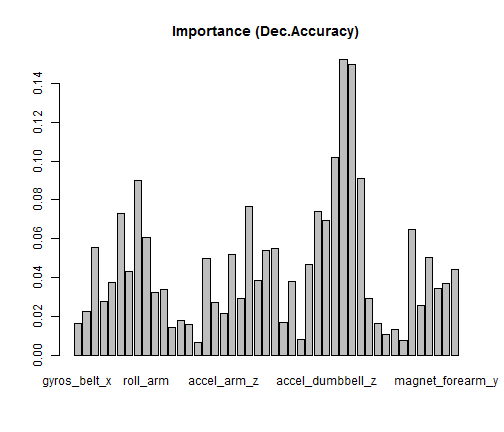
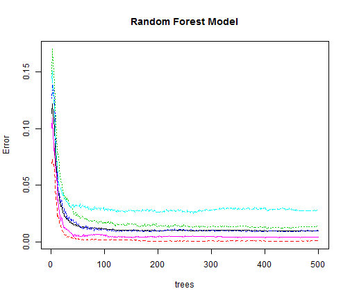

Human Activity Recognition
=======================================================

The aim of this study is to identify the how well an exercise is carried out by a person given a set of observations of itself by exploiting supervised machine learning techniques. Human activity recognition using sensory data has become an active field of research in the domain of mobile computing.
The *how (well)* investigation has only received little attention so far, even though it potentially provides useful information for a large variety of applications,such as sports training.


```
## Warning: cannot open file 'pml-training.csv': No such file or directory
```

```
## Error: cannot open the connection
```

```
## Warning: cannot open file 'pml-testing.csv': No such file or directory
```

```
## Error: cannot open the connection
```


Data Collection
-------------------------------
In this project, data is collected from accelerometers on the belt, forearm, arm, and dumbell of 6 young male participants [1]. The participants were asked to perform one set of 10 repetitions of the Unilateral Dumbbell Biceps Curl in five different fashions: exactly according to the specification 
(Class A) while the other 4 classes B, C, D and E correspond to common mistakes.
Data for this project come from [1], training data from [2] and test data from [3]. Our goal is to build an algorithm to predict the manner in which they did the exercise denoted by **classe** variable using all or a subset of attributes in the training set.

Data Preprocessing
-------------------------------
We load the training dataset in R with 

```

Error in eval(expr, envir, enclos) : object 'train' not found

```

 attributes and 

```

Error in eval(expr, envir, enclos) : object 'train' not found

```

 records. The train datset has significant number 

```

Error in eval(expr, envir, enclos) : object 'train' not found

```

 of missing values and #DIV/0! entries. 


```r
train <- read.csv("pml-training.csv", na.strings = c("NA", "#DIV/0!"))
x <- lapply(train, function(x) sum(is.na(x)) > 0.95 * dim(train)[1])
sub.train <- train[, names(x[x == FALSE])]
```


Therefore we remove undefined entries and columns with more than 95% missing values and the new training data has only 60 attributes. We are going to use the training data to build the model and evaluate how the model is performing. Therefore we will split the train set where 75% of the data will be used for model training and the remaining will be used for evaluating model performance. 


```r
library(caret)
indexTrain <- createDataPartition(sub.train$classe, p = 3/4, list = FALSE)
trainingset <- sub.train[indexTrain, ]
testingset <- sub.train[-indexTrain, ]
```

To check if the predictors are highly correlated or not, we compute the correlation matrix and remove predictors that result in absolute pairwise correlations greater than 0.90. We ignore the 7 attributes denoting user name, time stamp, window number etc and the classe variable while computing the correlation matrix and further preprocessing steps as they have less predictive scope in this case.


```r
highCorr <- findCorrelation(cor(trainingset[, -c(1:7, 60)]), 0.9)
trainingSet <- trainingset[, -highCorr]
testingSet <- testingset[, -highCorr]
```

This reduces the number of predictors to 53. Now that the final set of predictors is determined, the values may require transformations, ex centering or scaling, before being used in a model. 

The *preProcess* function from caret package can be used for predictor transformations in the training set and we standadardize the variables.


```r
preproc <- preProcess(trainingSet[, -c(1:7, 53)], method = "center")
proctrainset <- predict(preproc, trainingSet[, -c(1:7, 53)])
proctestset <- predict(preproc, testingSet[, -c(1:7, 53)])

# preprocess the Test data
id <- names(proctrainset)
processTest <- predict(preproc, test[, id])
```

```
## Error: object 'test' not found
```

```r

# add classe variable to the processed sets
proctrainset$classe <- trainingSet$classe
proctestset$classe <- testingSet$classe
```


Building Model in the training Set
-----------------------------------
We apply the Random Forests algorithm for training our model. Here is a brief summary of the a forest with N trees and dataset with n attributes (features):
  * Create N bootstrap samples of the data (Bagging)
  * Create N decision trees with $\sqrt{n}$ random features.
  * Pass a new through each tree and classify according to the majority vote.

While creating a decision tree using a bootstrap sample, one-third of the cases are left out of the sample while constructing the decision tree. We use this left out set to test how well the algorithm performed, and the estimate is called **Out of Bag** error. Therefore, in random forests, there is no need for cross-validation or a separate test set to get an unbiased estimate of the test set error. It is estimated internally by OOB error during the run as explaned in Breiman's blog.

```r
library(randomForest)
modelforest <- randomForest(classe ~ ., data = proctrainset, imp = T)
```

Random Forest algorithm also provides variable importance illustrated in the following bar graph.


```r
barplot(modelforest$importance[, 6], main = "Importance (Dec.Accuracy)")
```

 

```r
t <- modelforest$importance[order(modelforest$importance[, 6]), ]
varnam <- rev(names(tail(t, 5)[, 1]))
```

The top five important variables reported by the algorithm are: magnet_dumbbell_y, roll_forearm, magnet_dumbbell_x, pitch_forearm, magnet_belt_z.
Error Analysis
-------------
Using the randomForest library in R we fit the model with 500 and the following summarizes the output:


```r
modelforest
```

```
## 
## Call:
##  randomForest(formula = classe ~ ., data = proctrainset, imp = T) 
##                Type of random forest: classification
##                      Number of trees: 500
## No. of variables tried at each split: 6
## 
##         OOB estimate of  error rate: 1.01%
## Confusion matrix:
##      A    B    C    D    E class.error
## A 4180    1    2    1    1    0.001195
## B   25 2809   12    1    1    0.013694
## C    3   22 2541    1    0    0.010129
## D    0    0   61 2345    6    0.027778
## E    0    0    3    9 2694    0.004435
```

```r
predictclass <- predict(modelforest, proctestset)
errorrate <- sum(predictclass == proctestset$classe)/length(proctestset$classe)
# x<-table(predict(modelforest,proctestset),proctestset$classe)
tt <- table(actual = proctestset$classe, predicted = predict(modelforest, proctestset))
```


```r
plot(modelforest, main = "Random Forest Model")
```

 


We note that the OOB error is small 1.01%. To further evaluate model performance we use the 25% of the training set named as *testingSet*, preprocessing it and predicting the classe using our model we get 0.9912 error rate.

Conclusion
------------------
The random forest model along with the preprocessing performs 
well in predicting classe, particularly classes A and E, and use our model to predict the test set.


```r
answer <- predict(modelforest, processTest)
```

```
## Error: object 'processTest' not found
```

