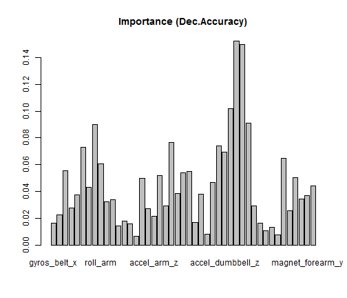

Automatic vs Manual Transmission and Fuel Efficiency in cars
========================================================
Executive Summary
------------------
Increase in gas prices these days have led us wondering if the kind of transmission could help with the fuel economy. This report attempts to analyze this relationship by studying the **mtcars** dataset extracted from the 1974 Motor Trend US magazine, and comprises fuel consumption and 10 aspects of automobile design and performance for 32 automobiles (1973-74 models). We use R programming language to perform the analysis and R Markdown to create this report. We used ``statistical inference'' to test our hypothesis, then exploratory analysis to get quick idea about the results and finally created regression model to quantify our that manual transmission favors fuel efficiency.


Data Preprocessing and Statistical Inference
-----------------------
We load the **mtcars** data frame in R and perform data preprocessing by transforming *am* to categorical variables with factors "automatic" and "manual". We also convert the attributes cyl, vs, gear, carb to categorical variables.  We begin our analysis by a statistical procedure to test whether the mean mpg is different for two transmission types.


We use a two sided *t* test, to test the null hypothesis *true difference in means equal to* 0. With the assumption that the populations are normal we reject the null hypothesis since the *p*-value  0.0014 is small. The t test also returns an estimate of 17.1474 for automatic transmission and 24.3923 for manual. Without assuming the data to have normal distribution we use Mann-Whitney-Wilcoxon Test reports a *p* value 0.0019. At 0.05 significance level, we conclude that the gas mileage data of manual and automatic transmissions in mtcar are nonidentical populations. 

Exploratory Analysis
------------------------------
To confirm our hypothesis from statistical inference and and check for confounding variables   we create few plots.From Figure 1 we note that a 4 cylinder car with a manual transmission gives best gas mileage and Figure 2 iluustrates an inverse relationship between horse power and mpg. Also, for a given horse power amount, manual transmission cars are generally more fuel efficient which seconds the intuition that sports cars generally have manual transmission.

Regression Analysis
------------------------------
We try fitting a linear model with all the variables and then perform stepwise model selection by AIC which reports **wt**, **cyl** and **hp** as the selected variables. The model has a small p value (1.506e-10) and 86.59% variation in the data can be explained by the stepAIC model. Further comparing the two linear models **model1=lm(mpg~am)** and **model2=stepAIC(lm(mpg~.),direction="both")** using ANOVA, we note that residual sum of squares decreases from 720.90 to 151.03 and the reduction is statistically significant, p value being 1.688e-08.


## Residual Analysis
To evaluate how well the model fits the data and that the data meet the assumptions of the model we plot regression **model2**. The plot on the left in Figure 3 shows that the residuals are spread both above and below the zero line, with the vertical spread around the line roughly of the same magnitude. The plot on the right reveals that normal quantile-quantile plot is a straight line which suggest that the residual errors are normally distributed . 

## Conclusion
The manual transmission is better for MPG, since the Coefficient from te regression is positive. There are several confounding variables, one of them being weight which can be interpretated as manual transmission has lower weight which results in higher fuel efficiency. Further to quantify the difference, from Table 1 we can 
interpret that considering weight and horsepower to be constant and number of cylinders to be 4, choosing transmission from automatic to manual increase the outcome variable by __1.8__ miles per gallon

Appendix
------------------------------
## Figure 1

```r
library(lattice)
xyplot(mpg ~ wt | factor(cyl), data = mtcars, pch = 16, layout = c(3, 1), groups = factor(am, 
    labels = c("Auto", "Manual")), type = c("p", "g"), xlab = "Weight (1000 lb)", 
    ylab = "Miles per Gallon", main = "MPG vs.Weight by Cylinder and Transmission", 
    auto.key = TRUE)
```

 

## Figure 2

```r
library(ggplot2)
mtcars$amf[mtcars$am == 0] <- "automatic"
mtcars$amf[mtcars$am == 1] <- "manual"
qplot(x = hp, y = mpg, facets = . ~ amf, xlab = "Horsepower", ylab = "Miles Per Gallon", 
    data = mtcars, main = "MPG vs.Horsepower by Transmission")
```

 


```r
model1 <- lm(mpg ~ am, data = mtcars)
model2 <- stepAIC(lm(mpg ~ ., data = mtcars), direction = "both")
testmodel <- anova(model1, model2)
```


## Table 1

```r
print(xtable(model2), type = "html")
```

<!-- html table generated in R 3.0.3 by xtable 1.7-3 package -->
<!-- Tue Jun 17 20:27:02 2014 -->
<TABLE border=1>
<TR> <TH>  </TH> <TH> Estimate </TH> <TH> Std. Error </TH> <TH> t value </TH> <TH> Pr(&gt;|t|) </TH>  </TR>
  <TR> <TD align="right"> (Intercept) </TD> <TD align="right"> 9.6178 </TD> <TD align="right"> 6.9596 </TD> <TD align="right"> 1.38 </TD> <TD align="right"> 0.1779 </TD> </TR>
  <TR> <TD align="right"> wt </TD> <TD align="right"> -3.9165 </TD> <TD align="right"> 0.7112 </TD> <TD align="right"> -5.51 </TD> <TD align="right"> 0.0000 </TD> </TR>
  <TR> <TD align="right"> qsec </TD> <TD align="right"> 1.2259 </TD> <TD align="right"> 0.2887 </TD> <TD align="right"> 4.25 </TD> <TD align="right"> 0.0002 </TD> </TR>
  <TR> <TD align="right"> am </TD> <TD align="right"> 2.9358 </TD> <TD align="right"> 1.4109 </TD> <TD align="right"> 2.08 </TD> <TD align="right"> 0.0467 </TD> </TR>
   </TABLE>


## Figure 3

```r
library(MASS)
par(mfrow = c(2, 1))
plot(model2, which = 1:2)
```

 

